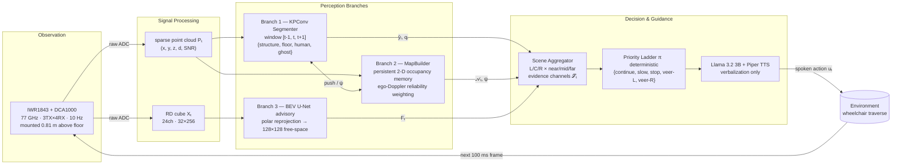

# RESA — Radar-Exclusive Spatial Assistant for Indoor mmWave Wheelchair Guidance

Source repository for the paper **"RESA: A Radar-Exclusive Spatial Assistant for Indoor mmWave Wheelchair Guidance"** (Emmert\*, Hullum Scott\*, Sanuk, Hardek, Mahmud†, Raychoudhury†, Miami University).

RESA converts 77 GHz mmWave radar measurements into real-time spoken navigation guidance for blind and low-vision (BLV) wheelchair users. RGB-D sensing is used **offline only** for calibration, autolabeling, and training; no camera or LiDAR is required at runtime.

---

## System Pipeline



The core design principle is **reliability-aware evidence fusion**: semantic labels, ego-Doppler directness, map persistence, and dense free-space signals are kept as separate channels so that multipath-contaminated or low-confidence radar frames cannot produce overconfident guidance.

---

## Repository Layout

| Directory | Paper section | Role |
|---|---|---|
| `branch1/` | §III-A, §III-B-1, §IV | ADC→point cloud (DSP), radar-camera calibration, OneFormer autolabeling, KPConv training |
| `branch2/` | §III-B-2, §III-C | Live loop, MapBuilder, scene aggregation, deterministic nav policy |
| `branch3/` | §III-B-3, §III-C | BEV U-Net free-space, LLM/TTS guidance |
| `sim_eval/` | §V | Replay evaluation, OneFormer decision comparison, BEV visualization |
| `config/` | §III-A | Radar profile, radar↔camera extrinsics, D435i intrinsics |

---

## Key Results

Evaluated on five held-out Dataset 2 sessions (745 RGB-D reference frames) from Armstrong Student Center — deliberately chosen for strong multipath and crowded class-transition periods.

| Component | Metric | Value |
|---|---|---|
| Branch 1 | Balanced accuracy (4-class) | **79.53%** |
| Branch 3 | Free-space IoU (held-out) | **95.37%** |
| Full guidance loop | Safety-aware agreement | **100.00%** |
| Full guidance loop | Unsafe-error rate | **0.00%** |
| Full guidance loop | Exact action agreement | 11.54% |

The 11.54% exact agreement reflects intentional conservatism: the radar policy emits *slow down* or *stop* where the RGB-D reference permits *continue*, treating over-caution as recoverable and collision risk as not.

---

## Navigating Code → Paper

| Paper concept | Primary file(s) |
|---|---|
| Radar DSP (range/Doppler FFT, CFAR, beamforming) | `branch1/processing/adc_to_pointcloud_v6.py` |
| Radar-camera calibration (§III-A) | `branch1/calib/` |
| OneFormer autolabeling pipeline (§III-A) | `branch1/processing/noah_scripts/OneFormer/` |
| Branch 1 temporal KPConv model (§III-B-1, §IV) | `branch1/models/3branch_common.py`, `branch1/models/kpconv/` |
| Branch 1 training driver | `branch1/training/train_hybrid_rd_patch_kpconv.py` |
| Ego-Doppler directness & ghost gating (§IV-B) | `branch2/directness_runtime.py`, `branch1/processing/ghost_teacher_fusion.py` |
| MapBuilder — persistent occupancy memory (§III-B-2) | `branch2/scene_pipeline.py` → `MapBuilder` |
| Scene aggregation & priority-ladder policy (§III-C) | `branch2/scene_pipeline.py` → `compute_nav_decision()` |
| BEV U-Net + sector probabilities (§III-B-3) | `branch3/branch3_unet.py` → `BEVUNet`, `sector_probabilities()` |
| LLM guidance + TTS (§III-C) | `branch3/guidance.py` → `GuidanceEngine`, `TTSEngine` |
| Live runtime entry point | `branch2/navigation_loop.py` |
| Replay evaluation (§V-E) | `sim_eval/branch3_replay_simulation.py`, `sim_eval/evaluate_replay_decisions_against_oneformer.py` |

---

## Hardware

| Component | Specification | Runtime role |
|---|---|---|
| Radar | IWR1843 Boost + DCA1000 | Always-on sensing |
| Compute | Jetson Orin Nano | Onboard inference |
| Camera | RealSense D435i | Offline calibration/labeling only |
| Speech | Piper TTS | Guidance output (≥ 4 s latency) |
| LLM | Llama 3.2 3B via Ollama | Verbalization only (≥ 8 s, non-blocking) |

Coordinate frame: *x* lateral (right+), *y* forward range, *z* up. Below-floor multipath cutoff: `MIN_VALID_Z = −0.851 m`. Live actionable range gate: 0.3–5.0 m.

---

## Artifacts

Calibration tools and datasets are available upon request at `github.com/MU-Smart/RESA_mmWave`. Trained checkpoints are not included; supply paths via environment variables before running the live loop or replay:

```
NAV_POINTCLOUD_RD_PATCH_MODEL_PT   # Branch 1 KPConv checkpoint
NAV_UNET_PT                        # Branch 3 BEV U-Net checkpoint
```
